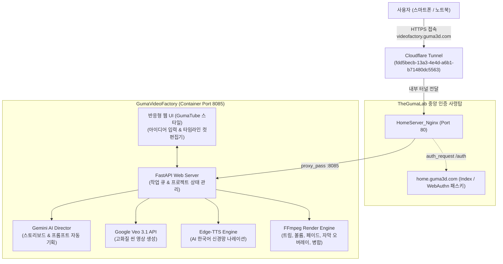

# GumaVideoFactory

> **AI 기반 숏폼 영상 기획·생성·웹 편집·배포 풀커버 자동화 스튜디오**  
> TheGumaLab 유니버스 홈서버 셀프호스팅 서비스 (`videofactory.guma3d.com`)

---

## 현재 제작 흐름 (2026-10-02)

추천 선택(아이디어 승인) → **Generate 3D Model** → 외형·자료 승인 → **Generate Preview** → 최종 승인 → **Create Video**.

- 목록은 카테고리 탭과 추천 카드, 12개씩 페이지를 나누는 제작 보관함으로 구성합니다. `/ideas/<id>`에서 제품별 단계·버전을 관리합니다. 기존 프로젝트는 `/legacy/<id>`에서 읽기 전용으로 보존하고 해당 제품에 연결합니다.
- 각 버튼 오른쪽 **↻**는 새 버전을 만듭니다. 일반 버튼은 기존 결과를 열어 중복 API 비용을 방지합니다. 진행 중에는 중복 제작을 막습니다. 실패한 버전도 남기며, 재생성은 새 폴더를 사용합니다.
- 테크 3D 단계: Gemini 검색으로 공개 모델·공식 사진을 찾고 실제 파일을 다운로드합니다. `.blend`, `.glb`, `.usdz`, `.obj`, `.fbx`를 지원합니다. 유료 결제·로그인을 우회하지 않습니다. 공개 다운로드의 비공개 프리뷰와 홍보용 사용 승인은 별개입니다. 출처·사용 조건은 화면에서 검토합니다.
- 모델이 없으면 실제 제품 사진을 Gemini가 분석해 제한된 JSON 기하 구조로 재구성합니다. 신뢰하는 Python 빌더만 실행하며 생성 모델의 임의 Python은 실행하지 않습니다. 사진이 없거나 정확한 제품을 식별하지 못하면 실패 상태로 남기고 참고 사진 등록을 안내합니다. 초안의 불확실성과 네 방향 렌더를 표시하며 **사진만으로 정확한 제품 복원을 보장하지 않습니다**.
- 외부 모델은 정적 메시·안전한 재질로 변환합니다. 드라이버·모디파이어·외부 코드·복잡한 노드 효과는 제거합니다. 기본 색상·금속성·거칠기와 안전한 로컬/내장 색상 텍스처를 보존하지만 모든 재질·구조 변환의 완전한 호환성을 보장하지 않습니다. 실물 대조 후 외형과 사용 조건을 모두 승인해야 다음 단계로 진행합니다.
- 프리뷰: 승인한 모델로 6컷을 기획합니다. 제품 컷은 Blender, 2개 원리 개념도 컷은 이미지 모델을 사용합니다. 핵심 기능 외에 추가 주요 기능도 대본에 포함합니다. 모델 승인 전에는 콘티·이미지 생성 API를 호출하지 않습니다.
- 영상: 프리뷰의 대본과 HTTPS 상품 링크를 최종 승인해야 시작합니다. 제품 외형은 승인한 `.blend`를 직접 렌더링하며 Veo로 변형하지 않습니다. 원리 개념도만 Veo를 사용합니다. 컷별 TTS 길이에 맞춰 영상을 합성하여 음성이 잘리지 않게 합니다. 사용한 모델·프리뷰 버전과 수정 대본·출처를 영상 버전에 보관합니다.
- 음식은 **Prepare Real Media → Generate Preview → Create Video**로 실사 방식을 유지합니다. 출처·제작자·사용 조건을 포함해 실제 사진/MP4를 등록하고 새 자료 버전을 생성합니다. 생성형 음식이나 Blender 모델은 사용하지 않습니다. 자료가 부족하면 마지막 자료가 여러 컷에 반복될 수 있으므로 프리뷰에서 구성과 실제 상품의 일치를 확인해야 합니다.
- 이전 승인 버전은 계속 선택할 수 있습니다. 새 모델 초안 생성으로 과거 영상·프리뷰를 수정하지 않습니다. 승인 모델 파일의 SHA-256을 기록해 이후 외부 변경이 있으면 재승인을 요구합니다.

저장 구조(제품 폴더 ID와 이름은 `idea.json`에 함께 기록):

```text
storage/products/<product-id>/
  idea.json
  inputs/                  # 새 버전 생성에 사용할 추가 참고 자료
  3DModel/v0001/           # version.json, sources.json, model.blend, view_1~4.png
  Preview/v0001/           # version.json, storyboard.json, scene_01~06.png
  Video/v0001/             # 승인 대본, 개별 클립·음성, final.mp4, sources.json
```

Blender는 PC 데스크톱 설치 없이 컨테이너에서 실행됩니다. Dockerfile은 공식 **Blender 4.5.14 LTS** 아카이브를 SHA-256으로 검증해 설치합니다. Cycles CPU·노이즈 제거·64 samples이며 기본 영상은 720×1280/24fps입니다. `BLENDER_VIDEO_WIDTH=1080`으로 높일 수 있으나 렌더 시간이 증가합니다. 한 번에 하나의 Blender 프로세스만 실행합니다. 현재 작업 큐는 단일 uvicorn 프로세스의 BackgroundTasks이며 서버 재시작으로 중단된 작업은 실패로 표시합니다. 결과 파일은 보존되고 ↻로 다시 만들 수 있습니다. 다중 uvicorn worker로 늘리기 전에는 영속 작업 큐와 프로세스 간 잠금이 필요합니다.

```powershell
docker compose build videofactory
docker compose up -d videofactory
docker exec GumaVideoFactory_app python -m unittest discover -s tests -q
docker exec GumaVideoFactory_app python -m tests.blender_smoke
```

정기 추천은 변경하지 않습니다. 한국시간 **09·15·21시**, 매일 카테고리별 5개를 조사하고 추천·조사 이력을 누적합니다. 예약 조사는 제작 API를 호출하지 않습니다. `RESEARCH.md` 참조. 자막 오버레이·임의 타임라인 편집·완전한 사진측량 복원·결제형 모델 구매는 구현 범위에 포함하지 않습니다.

## 이전 파이프라인과 초기 설계 (2026-10-01, 기록용)

아래는 구형 `/api/projects` 및 초기 설계 기록입니다. 현재 웹의 제작 흐름은 위의 제품별 버전 시스템을 기준으로 합니다.

테크·음식 탭에서 추천을 선택하고 프리뷰를 검토한 뒤 최종 승인하면 영상을 만듭니다. 직접 아이디어 입력 폼은 제거했습니다. 기본 6컷·9:16·한국어 음성이며 카테고리 구성은 `app/core/categories.py`에서 관리합니다.

- 테크: 핵심 새 기능을 생활 문제와 연결하는 정밀 3D 설명과 함께 추가 주요 기능 2~3개도 소개합니다. 조사 목록의 `supporting_features`는 2개 이상 필수이며 근거를 함께 기록합니다. 프리뷰는 이미지 모델, 승인 후 컷 영상은 Veo로 생성합니다.
- 음식: 실제 사진·실사 영상만 사용합니다. 음식용 생성 이미지·Veo·애니메이션 전환을 호출하지 않습니다. 공식 재사용 허용 자료를 우선하며 없으면 상업적 재사용 가능한 CC 등 공개 자료를 조사합니다. Google 검색은 자료 발견용이고 원본 사용 조건을 별도로 확인합니다. 짧게 사용하거나 공개됐다는 이유만으로 권한을 추정하지 않습니다.
- 조사 단계에 `media_sources`를 기록하고 `recommendation_import.py`가 직접 HTTPS 사진/MP4 파일을 확보·검증합니다. 일반 웹 페이지는 다운로드 파일로 처리하지 않습니다. YouTube CC BY 영상은 공개 단일 영상 주소와 플랫폼 CC 메타데이터가 확인되면 지정한 짧은 구간만 확보합니다. 로그인·다운로드 차단·CC 조건 미확인 시 자료 대기로 남깁니다. 확인된 직접 파일이 있으면 추천 선택 시 프리뷰에 자동 배치합니다. 부족한 컷은 실사 자료 등록 대기로 표시됩니다.
- 프리뷰에서 실제 자료, 원본 출처·제작자·사용 조건을 확인하며 사진/MP4 교체와 대본 수정이 가능합니다. 영상은 시작 위치·발췌 길이(기본 3초, 최대 4초)를 지정합니다. 원본 오디오는 제거하고 필요한 남은 장면 시간은 마지막 프레임으로 채웁니다. 사진은 원본을 비율에 맞춰 배치합니다. 다른 제품 설명용 자료는 `illustrative`로 명시하며 광고 상품 자체인 것처럼 소개하지 않습니다.
- 마지막 컷은 실제 상품 사진을 등록합니다. 모든 프리뷰와 실사 자료·상품 사진·HTTPS 링크가 준비되고 명시적으로 승인해야 영상 제작이 시작됩니다. 최종 영상과 함께 게시 설명란용 출처 표기 파일을 다운로드할 수 있습니다. CC BY-SA 등 추가 조건은 게시 때도 이행해야 합니다.

한국시간 09:00·15:00·21:00 Codex 예약 조사로 매일 카테고리별 5개 목록을 갱신합니다. 조사 지침과 JSON 형식은 `RESEARCH.md`에 있습니다. 로컬 PC와 Codex 앱이 실행 중이어야 합니다. 이미 선택한 프로젝트는 당시 추천과 제작 방식을 보존하며 새 프로젝트부터 변경된 연출을 적용합니다.

기본 6컷은 약 24초입니다. `PLANNER_MODEL` 실제 설정을 웹에 표시하며 현재 `gemini-3.8-flash`, 테크 이미지 모델 기본값은 `gemini-2.5-flash-image`입니다. 프리뷰 비용은 테크 이미지 생성 시, Veo 비용은 테크 승인 후 발생합니다. 음식도 대본 기획 API와 TTS·편집을 사용합니다. 사진·영상·추천 데이터는 Git에서 제외합니다.

자막 오버레이, 타임라인 편집, 일반 YouTube 영상 다운로드, 자동 상품 링크 검색은 제공하지 않습니다. 자료가 확보되지 않은 음식 컷은 생성 영상으로 대체하지 않습니다. 아래 장기 설계는 현재 구현 전체를 의미하지 않습니다.

---

## 📌 1. 프로젝트 개요

`GumaVideoFactory`는 웹 브라우저에서 사용자가 아이디어나 주제를 입력하면, 기획부터 장면 분할, AI 비디오(Veo 3.1) 생성, 음성(Edge-TTS) 합성, 자막 및 트랜지션 효과 적용, 그리고 웹 타임라인 컷 편집까지 한곳에서 처리하는 **엔드투엔드(End-to-End) 숏폼 영상 자동화 제작 플랫폼**입니다.

홈서버(`Guma3D`)에서 Docker 컨테이너로 상시 구동되며, Cloudflare Tunnel을 통해 외부(모바일/노트북)에서도 포트포워딩 없이 안전하게 웹으로 접속하여 영상을 생성하고 편집할 수 있습니다.

---

## 🏗️ 2. 시스템 및 네트워크 아키텍처



### 인프라 및 도메인 사양
| 항목 | 사양 / 설정값 | 설명 |
| :--- | :--- | :--- |
| **호스트 서버** | `HomeServer (Guma3D)` | Windows 11 Pro, Docker Desktop 환경 |
| **공개 도메인** | `https://videofactory.guma3d.com` | Cloudflare 관리 도메인 |
| **내부 포트** | `8085:8085` | 호스트 포트 충돌 방지 격리 바인딩 |
| **중앙 인증** | `home.guma3d.com` (WebAuthn) | Nginx `auth_request /auth;` 연동으로 비인가자 완벽 차단 |
| **터널 연동** | Cloudflare Tunnel (`GumaHomeServer`) | `videofactory.guma3d.com` -> `http://nginx:80` 무포트포워딩 |
| **UI 테마** | GumaTube 스타일 다크 모드 | 레드 악센트, 글래스모피즘 카드, 반응형 모바일 최적화 |

---

## 💳 3. Google AI & Veo 3.1 크레딧 연동

* **Google AI Ultra 요금제 혜택**: 월 \$100 상당의 Google Cloud 개발자 크레딧 지원 풀(현재 잔액 약 ₩608,644)과 연동 완료.
* **연결 프로젝트**: Google Cloud `GumaVideoFactory` (`gen-lang-client-0264830326` / Project ID: `592247142983`)
* **결제 계정**: `My Billing Account` (`01470E-CD924E-FB50E6`)
* **요금 모드**: AI Studio "Tier 1 Prepay" 상태로, 별도의 신용카드 실청구 없이 크레딧 풀에서 Veo 3.1 및 Gemini 호출 비용이 자동 차감됩니다.
* **지원 모델**:
  * `veo-3.1-fast-generate-preview` (기본 권장, 빠른 렌더링 및 비용 효율적)
  * `veo-3.1-generate-preview` (최고화질 모드)
  * `PLANNER_MODEL` (현재 `gemini-3.8-flash`, 스토리보드 기획)

---

## 🎬 4. 풀커버 자동화 파이프라인 (Life Cycle)

```mermaid
sequenceDiagram
    autonumber
    actor User as 사용자 (Web 브라우저)
    participant Web as Web Dashboard (GumaTube 스타일)
    participant API as FastAPI Backend (:8085)
    participant Gemini as Gemini AI Director
    participant Veo as Veo 3.1 Video API
    participant TTS as Edge-TTS Audio Engine
    participant FFmpeg as FFmpeg Video Engine

    User->>Web: 영상 아이디어 입력 (주제, 지속시간, 화면비율 등)
    Web->>API: 영상 생성 작업 생성 요청 (`POST /api/generate`)
    API-->>Web: 작업 ID 반환 및 백그라운드 큐 등록
    
    rect rgb(30, 30, 45)
        Note over API, Gemini: 1단계: AI Director 스토리보드 기획
        API->>Gemini: 아이디어 기반 구조화 프롬프트 요청 (JSON Schema)
        Gemini-->>API: 씬 구성(5~8컷), 카메라 무빙, Veo 전용 영문 프롬프트, 한국어 대본 반환
    end

    rect rgb(30, 45, 30)
        Note over API, FFmpeg: 2단계: 씬 비디오 생성 & 오디오 합성 (병렬/순차)
        par 각 컷씬 생성
            API->>Veo: 컷별 비디오 생성 요청 (`veo-3.1-fast-generate-preview`)
            Veo-->>API: MP4 클립 파일 다운로드
        and 나레이션 음성 합성
            API->>TTS: 대본 음성 변환 (`ko-KR-SunHiNeural` 고품질 보이스)
            TTS-->>API: 씬별 오디오 (MP3) 저장
        end
    end

    rect rgb(45, 30, 30)
        Note over API, FFmpeg: 3단계: 1차 합성 렌더링
        API->>FFmpeg: 비디오 클립 연결, 9:16 스케일링, 오디오 믹싱, 자막 번-인
        FFmpeg-->>API: 1차 프리뷰 영상 생성 완료 (`draft.mp4`)
        API-->>Web: 웹소켓/폴링 작업 완료 상태 업데이트
    end

    User->>Web: 웹 플레이어에서 완성 영상 확인
    
    opt 웹 타임라인 간이 편집기 (수정 필요 시)
        User->>Web: 컷 자르기(Trim), BGM 볼륨 조절, 페이드 인/아웃, 자막 텍스트 수정
        Web->>API: 타임라인 편집 렌더링 요청 (`POST /api/render`)
        API->>FFmpeg: 사용자 타임라인 파라미터 적용 재렌더링
        FFmpeg-->>API: 최종본 완성 (`final.mp4`)
        API-->>Web: 즉시 다운로드 및 공유 링크 제공
    end
```



### 상세 기능 명세
1. **아이디어 입력 & AI Director 기획**:
   * 사용자가 원하는 영상 컨셉 입력 시, Gemini가 30~40초 규격의 숏폼(5~8개 컷)으로 자동 기획
   * 컷별 카메라 무빙(Dolly, Pan, Drone), 조명/화풍 프롬프트, 씬 길이(3~5초), 한국어 대본 자동 산출
2. **Veo 3.1 비디오 렌더링**:
   * Google Cloud 개발자 크레딧을 기반으로 실시간 비디오 생성
   * 9:16 세로 숏폼(TikTok/Reels/Shorts) 및 16:9 가로 영상 선택 가능
3. **오디오 합성 & 1차 병합**:
   * `edge-tts` 고품질 한국어 AI 음성(여성 SunHi, 남성 InJoon 등)으로 대본 오디오 생성
   * FFmpeg로 씬 클립과 오디오를 정확한 싱크로 1차 결합
4. **웹 타임라인 컷 편집기 (Web Editor)**:
   * **영상 자르기 (Trim)**: 각 컷의 시작/끝 지점 슬라이더 조절
   * **사운드 믹서**: 나레이션 볼륨 조절 및 배경음악(BGM) 페이더
   * **트랜지션 효과**: 컷 전환 페이드 인/아웃(Fade to Black), 크로스페이드
   * **자막(Subtitle)**: 대본 텍스트 수정 및 폰트/위치 오버레이
   * **씬 재생성(Regenerate)**: 마음에 들지 않는 특정 컷만 프롬프트 수정 후 재추출
5. **최종 저장 및 공유**:
   * 홈서버 영구 스토리지에 최종 mp4 저장 및 웹에서 즉시 다운로드

---

## 🧹 5. TheGumaLab 서비스 개편 내역

2026-09-29 인프라 리팩토링의 일환으로 아래와 같이 서비스 풀을 개편했습니다:

### 제거된 레거시 서비스 (Deprecated & Removed)
* `GumaTutorDoc` (`gumatutordoc.guma3d.com`): Git 코드베이스 삭제, 홈서버 컨테이너 종료/삭제, Cloudflare 라우트 삭제 완료.
* `GumaStockReport` (`gumastockreport.guma3d.com`): Git 코드베이스 삭제, 홈서버 컨테이너/Redis 종료/삭제, Cloudflare 라우트 삭제 완료.
* `GumaKidsPython` (`gumakidspython.guma3d.com`): Git 코드베이스 삭제, 홈서버 컨테이너 종료/삭제, Cloudflare 라우트 삭제 완료.

### 현재 TheGumaLab 활성 서비스 현황
| 서비스명 | 서브도메인 | 포트 | 역할 |
| :--- | :--- | :--- | :--- |
| **GumaLab Portal** | `home.guma3d.com` | `8081` | 홈서버 메인 포털 & WebAuthn 패스키 사령탑 |
| **Server Status** | `gumaserverstatus.guma3d.com` | `8080` | 홈서버 실시간 리소스/하드웨어 모니터링 |
| **GumaTube** | `gumatube.guma3d.com` | `8083` | 유튜브 영상 다운로드 및 자막/요약 추출 |
| **GumaVideoFactory** | `videofactory.guma3d.com` | `8085` | **(NEW)** AI 숏폼 영상 전자동 생성 및 편집 스튜디오 |

---

## 📁 6. 프로젝트 디렉터리 구조

```text
GumaVideoFactory/
├── README.md                 # 본 시스템 설계 및 가이드 문서
├── .gitignore                # 환경변수, 영상 캐시, 출력물 제외
├── .env.example              # 환경변수 템플릿
├── docker-compose.yml        # Docker 배포 정의 (Port 8085:8085)
├── Dockerfile                # Python 3.12 + FFmpeg 컨테이너 환경
├── requirements.txt          # fastapi, uvicorn, google-genai, edge-tts 등
├── app/
│   ├── main.py               # FastAPI 진입점 및 REST API
│   ├── config.py             # 환경 설정 및 API 키 로더
│   ├── core/
│   │   ├── planner.py        # Gemini AI Director (스토리보드 기획)
│   │   ├── veo_client.py     # Veo 3.1 비디오 생성 클라이언트
│   │   ├── tts_engine.py     # Edge-TTS 음성 합성 엔진
│   │   └── ffmpeg_mixer.py   # FFmpeg 컷편집, 자막, 트랜지션, 렌더링 엔진
│   └── templates/            # 반응형 웹 UI (GumaTube 스타일)
│       └── index.html        # 메인 대시보드 (아이디어 입력 & 프로젝트 목록)
└── storage/                  # 홈서버 영구 볼륨 매핑
    ├── projects/             # 프로젝트별 메타데이터 (JSON)
    ├── raw_clips/            # Veo 원본 컷 클립
    ├── audio/                # 생성된 TTS 및 BGM 오디오
    └── outputs/              # 최종 렌더링 완료 영상
```

---

## 🔑 7. 환경변수 및 인증 설정

프로젝트 루트의 `.env` 파일에 아래 설정을 등록합니다 (Git 커밋 절대 금지):

```env
# Google AI Studio / Gemini API Key (GumaVideoFactory 프로젝트)
GEMINI_API_KEY=your_gemini_api_key_here

# 서버 설정
PORT=8085
HOST=0.0.0.0

# 기본 모델 설정
PLANNER_MODEL=gemini-2.5-flash
VEO_MODEL=veo-3.1-fast-generate-preview
DEFAULT_VOICE=ko-KR-SunHiNeural
```

---

## 🚀 8. 배포 및 Git 워크플로우

TheGumaLab 표준 CI/CD 규칙을 준수합니다:

### 개발 및 커밋 (노트북 Gram 기준)
```powershell
# 변경사항 스테이징
git add Nginx/ Index/ GumaVideoFactory/ .gitignore

# 커밋 컨벤션 준수 ((Gram) 접두어 필수)
git commit -m "(Gram) feat: remove deprecated services and deploy GumaVideoFactory service"

# 원격 동기화
git pull --rebase origin main
git push origin main
```

### 홈서버 배포 (HomeServer 기준)
```powershell
# 홈서버 저장소 동기화
cd D:\TheGumaLab
git pull origin main

# Nginx 리로드
cd D:\TheGumaLab\Nginx
docker exec HomeServer_Nginx nginx -t
docker exec HomeServer_Nginx nginx -s reload

# GumaVideoFactory 컨테이너 빌드 및 구동
cd D:\TheGumaLab\GumaVideoFactory
docker compose up -d --build
```
