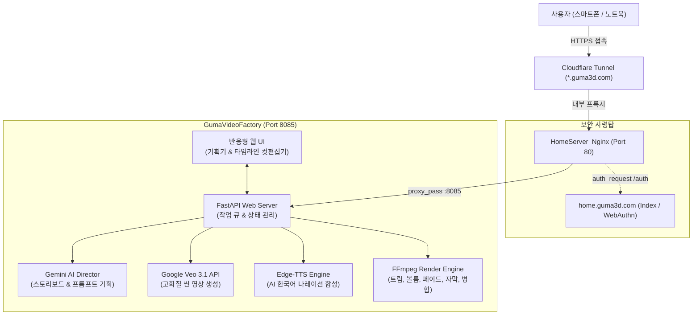
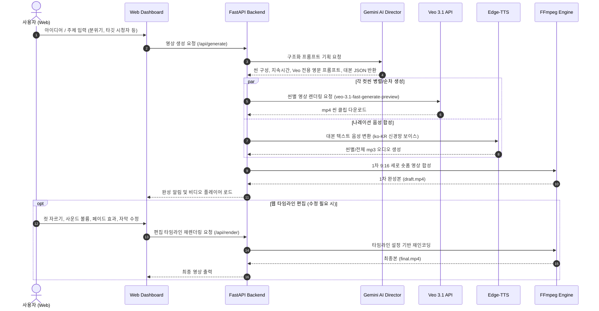

# GumaVideoFactory

> **AI 기반 숏폼 영상 기획·생성·웹 편집·배포 풀커버 자동화 스튜디오**  
> TheGumaLab 유니버스 홈서버 셀프호스팅 서비스 (`videofactory.guma3d.com`)

---

## 📌 1. 프로젝트 개요

`GumaVideoFactory`는 웹 브라우저에서 간단한 아이디어나 주제를 입력하면, 기획부터 장면 분할, AI 비디오(Veo 3.1) 생성, 음성(TTS) 합성, 자막 및 트랜지션 효과 적용, 그리고 웹 타임라인 컷 편집까지 한곳에서 처리하는 **엔드투엔드 숏폼 영상 자동화 제작 플랫폼**입니다.

홈서버(`Guma3D`)에서 Docker 컨테이너로 상시 구동되며, Cloudflare Tunnel을 통해 외부(모바일/노트북)에서도 안전하게 접속하여 영상을 제작하고 편집할 수 있습니다.

---

## 🏗️ 2. 시스템 아키텍처



### 인프라 스펙 (TheGumaLab 표준)
* **호스트**: HomeServer (`Guma3D`, Windows / Docker Desktop)
* **서브도메인**: `https://videofactory.guma3d.com`
* **내부 포트**: `8085` (기존 서비스 포트 충돌 방지)
* **보안 연동**: Nginx `auth_request /auth;`를 통해 `home.guma3d.com` 패스키(WebAuthn) 로그인 사용자만 접근 허용
* **외부 터널**: Cloudflare Tunnel (`HomeServer_Cloudflared`)을 통한 무포트포워딩 HTTPS 암호화 통신

---

## 🎬 3. 영상 제작 파이프라인 (타임라인)



### 상세 기능 명세
1. **아이디어 입력 & AI Director 기획**:
   * 사용자가 원하는 영상 컨셉 입력 시, Gemini가 30~40초 규격의 숏폼(5~8개 컷)으로 자동 기획
   * 컷별 카메라 무빙(Dolly, Pan, Drone), 조명/화풍 프롬프트, 씬 길이(3~5초), 한국어 대본 생성
2. **Veo 3.1 API 비디오 렌더링**:
   * Google AI Ultra 요금제 혜택 크레딧(월 $100 Cloud 크레딧) 풀을 활용하여 실시간 API 생성
   * 비용 및 속도 최적화를 위해 기본 `veo-3.1-fast-generate-preview` 모델 활용 (필요시 Standard 고화질 선택)
3. **오디오 합성 & 1차 병합**:
   * `edge-tts` 고품질 한국어 AI 음성(남/여 선택 가능)으로 대본 오디오 생성
   * FFmpeg로 1080x1920 (9:16) 숏폼 규격에 맞게 비디오 클립과 오디오 1차 싱크 결합
4. **웹 타임라인 컷 편집기 (Web Editor)**:
   * **영상 자르기 (Trim)**: 각 컷의 시작/끝 지점 슬라이더 조절
   * **사운드 믹서**: 나레이션 볼륨 조절 및 배경음악(BGM) 페이더
   * **트랜지션 효과**: 컷 전환 페이드 인/아웃(Fade to Black), 크로스페이드
   * **자막(Subtitle)**: 대본 텍스트 수정 및 폰트/위치 오버레이
   * **씬 재생성(Regenerate)**: 마음에 들지 않는 특정 컷만 프롬프트 수정 후 재추출
5. **최종 저장 및 공유**:
   * 홈서버 스토리지에 최종 mp4 저장 및 웹에서 즉시 다운로드

---

## 📁 4. 프로젝트 디렉터리 구조

```text
GumaVideoFactory/
├── README.md                 # 본 시스템 설계 및 가이드 문서
├── .gitignore                # 환경변수, 영상 캐시, 출력물 제외
├── .env.example              # 환경변수 템플릿
├── docker-compose.yml        # Docker 배포 정의 (Port 8085:8085)
├── Dockerfile                # Python 3.12 + FFmpeg 컨테이너 환경
├── requirements.txt          # fastapi, uvicorn, google-genai, edge-tts 등
├── app/
│   ├── main.py               # FastAPI 진입점 및 라우터
│   ├── config.py             # 환경 설정 및 API 키 로더
│   ├── core/
│   │   ├── planner.py        # Gemini AI Director (스토리보드 기획)
│   │   ├── veo_client.py     # Veo 3.1 비디오 생성 클라이언트
│   │   ├── tts_engine.py     # Edge-TTS 음성 합성 엔진
│   │   └── ffmpeg_mixer.py   # FFmpeg 컷편집, 자막, 트랜지션, 렌더링 엔진
│   └── templates/            # 반응형 웹 UI
│       ├── index.html        # 메인 대시보드 (아이디어 입력 & 프로젝트 목록)
│       └── editor.html       # 타임라인 컷 편집기 UI
└── storage/                  # 홈서버 영구 볼륨 매핑
    ├── projects/             # 프로젝트별 메타데이터 (JSON)
    ├── raw_clips/            # Veo 원본 컷 클립
    ├── audio/                # 생성된 TTS 및 BGM 오디오
    └── outputs/              # 최종 렌더링 완료 영상
```

---

## 🔑 5. 환경변수 및 인증 설정

프로젝트 루트의 `.env` 파일에 아래 설정을 등록합니다 (Git 커밋 절대 금지):

```env
# Google AI Studio / Gemini API Key (GumaVideoFactory 프로젝트)
GEMINI_API_KEY=your_gemini_api_key_here

# 서버 설정
PORT=8085
HOST=0.0.0.0

# 기본 모델 설정
PLANNER_MODEL=gemini-2.5-flash
VEO_MODEL=veo-3.1-fast-generate-preview
DEFAULT_VOICE=ko-KR-SunHiNeural
```

---

## 🚀 6. 배포 및 Git 워크플로우

TheGumaLab 표준 CI/CD 규칙을 준수합니다:

### 개발 및 커밋 (노트북 Gram 기준)
```powershell
# 변경사항 커밋 (컨벤션 준수)
git add GumaVideoFactory/
git commit -m "(Gram) feat: initialize GumaVideoFactory full-cover automation system design"

# GitHub main 푸시 -> HomeServer 자동 배포
git push origin main
```

### 홈서버 수동 갱신 (필요 시)
```bat
pull_update.bat GumaVideoFactory
```
