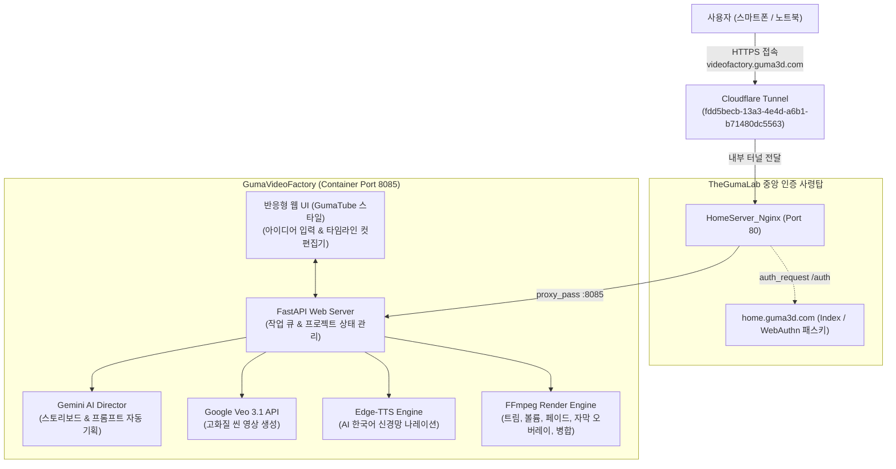

# GumaVideoFactory

> **AI 기반 숏폼 영상 기획·생성·웹 편집·배포 풀커버 자동화 스튜디오**  
> TheGumaLab 유니버스 홈서버 셀프호스팅 서비스 (`videofactory.guma3d.com`)

---

## 📌 1. 프로젝트 개요

`GumaVideoFactory`는 웹 브라우저에서 사용자가 아이디어나 주제를 입력하면, 기획부터 장면 분할, AI 비디오(Veo 3.1) 생성, 음성(Edge-TTS) 합성, 자막 및 트랜지션 효과 적용, 그리고 웹 타임라인 컷 편집까지 한곳에서 처리하는 **엔드투엔드(End-to-End) 숏폼 영상 자동화 제작 플랫폼**입니다.

홈서버(`Guma3D`)에서 Docker 컨테이너로 상시 구동되며, Cloudflare Tunnel을 통해 외부(모바일/노트북)에서도 포트포워딩 없이 안전하게 웹으로 접속하여 영상을 생성하고 편집할 수 있습니다.

---

## 🏗️ 2. 시스템 및 네트워크 아키텍처



### 인프라 및 도메인 사양
| 항목 | 사양 / 설정값 | 설명 |
| :--- | :--- | :--- |
| **호스트 서버** | `HomeServer (Guma3D)` | Windows 11 Pro, Docker Desktop 환경 |
| **공개 도메인** | `https://videofactory.guma3d.com` | Cloudflare 관리 도메인 |
| **내부 포트** | `8085:8085` | 호스트 포트 충돌 방지 격리 바인딩 |
| **중앙 인증** | `home.guma3d.com` (WebAuthn) | Nginx `auth_request /auth;` 연동으로 비인가자 완벽 차단 |
| **터널 연동** | Cloudflare Tunnel (`GumaHomeServer`) | `videofactory.guma3d.com` -> `http://nginx:80` 무포트포워딩 |
| **UI 테마** | GumaTube 스타일 다크 모드 | 레드 악센트, 글래스모피즘 카드, 반응형 모바일 최적화 |

---

## 💳 3. Google AI & Veo 3.1 크레딧 연동

* **Google AI Ultra 요금제 혜택**: 월 \$100 상당의 Google Cloud 개발자 크레딧 지원 풀(현재 잔액 약 ₩608,644)과 연동 완료.
* **연결 프로젝트**: Google Cloud `GumaVideoFactory` (`gen-lang-client-0264830326` / Project ID: `592247142983`)
* **결제 계정**: `My Billing Account` (`01470E-CD924E-FB50E6`)
* **요금 모드**: AI Studio "Tier 1 Prepay" 상태로, 별도의 신용카드 실청구 없이 크레딧 풀에서 Veo 3.1 및 Gemini 호출 비용이 자동 차감됩니다.
* **지원 모델**:
  * `veo-3.1-fast-generate-preview` (기본 권장, 빠른 렌더링 및 비용 효율적)
  * `veo-3.1-generate-preview` (최고화질 모드)
  * `gemini-2.5-flash` (스토리보드 기획 및 프롬프트 엔지니어링)

---

## 🎬 4. 풀커버 자동화 파이프라인 (Life Cycle)

```mermaid
sequenceDiagram
    autonumber
    actor User as 사용자 (Web 브라우저)
    participant Web as Web Dashboard (GumaTube 스타일)
    participant API as FastAPI Backend (:8085)
    participant Gemini as Gemini AI Director
    participant Veo as Veo 3.1 Video API
    participant TTS as Edge-TTS Audio Engine
    participant FFmpeg as FFmpeg Video Engine

    User->>Web: 영상 아이디어 입력 (주제, 지속시간, 화면비율 등)
    Web->>API: 영상 생성 작업 생성 요청 (`POST /api/generate`)
    API-->>Web: 작업 ID 반환 및 백그라운드 큐 등록
    
    rect rgb(30, 30, 45)
        Note over API, Gemini: 1단계: AI Director 스토리보드 기획
        API->>Gemini: 아이디어 기반 구조화 프롬프트 요청 (JSON Schema)
        Gemini-->>API: 씬 구성(5~8컷), 카메라 무빙, Veo 전용 영문 프롬프트, 한국어 대본 반환
    end

    rect rgb(30, 45, 30)
        Note over API, FFmpeg: 2단계: 씬 비디오 생성 & 오디오 합성 (병렬/순차)
        par 각 컷씬 생성
            API->>Veo: 컷별 비디오 생성 요청 (`veo-3.1-fast-generate-preview`)
            Veo-->>API: MP4 클립 파일 다운로드
        and 나레이션 음성 합성
            API->>TTS: 대본 음성 변환 (`ko-KR-SunHiNeural` 고품질 보이스)
            TTS-->>API: 씬별 오디오 (MP3) 저장
        end
    end

    rect rgb(45, 30, 30)
        Note over API, FFmpeg: 3단계: 1차 합성 렌더링
        API->>FFmpeg: 비디오 클립 연결, 9:16 스케일링, 오디오 믹싱, 자막 번-인
        FFmpeg-->>API: 1차 프리뷰 영상 생성 완료 (`draft.mp4`)
        API-->>Web: 웹소켓/폴링 작업 완료 상태 업데이트
    end

    User->>Web: 웹 플레이어에서 완성 영상 확인
    
    opt 웹 타임라인 간이 편집기 (수정 필요 시)
        User->>Web: 컷 자르기(Trim), BGM 볼륨 조절, 페이드 인/아웃, 자막 텍스트 수정
        Web->>API: 타임라인 편집 렌더링 요청 (`POST /api/render`)
        API->>FFmpeg: 사용자 타임라인 파라미터 적용 재렌더링
        FFmpeg-->>API: 최종본 완성 (`final.mp4`)
        API-->>Web: 즉시 다운로드 및 공유 링크 제공
    end
```



### 상세 기능 명세
1. **아이디어 입력 & AI Director 기획**:
   * 사용자가 원하는 영상 컨셉 입력 시, Gemini가 30~40초 규격의 숏폼(5~8개 컷)으로 자동 기획
   * 컷별 카메라 무빙(Dolly, Pan, Drone), 조명/화풍 프롬프트, 씬 길이(3~5초), 한국어 대본 자동 산출
2. **Veo 3.1 비디오 렌더링**:
   * Google Cloud 개발자 크레딧을 기반으로 실시간 비디오 생성
   * 9:16 세로 숏폼(TikTok/Reels/Shorts) 및 16:9 가로 영상 선택 가능
3. **오디오 합성 & 1차 병합**:
   * `edge-tts` 고품질 한국어 AI 음성(여성 SunHi, 남성 InJoon 등)으로 대본 오디오 생성
   * FFmpeg로 씬 클립과 오디오를 정확한 싱크로 1차 결합
4. **웹 타임라인 컷 편집기 (Web Editor)**:
   * **영상 자르기 (Trim)**: 각 컷의 시작/끝 지점 슬라이더 조절
   * **사운드 믹서**: 나레이션 볼륨 조절 및 배경음악(BGM) 페이더
   * **트랜지션 효과**: 컷 전환 페이드 인/아웃(Fade to Black), 크로스페이드
   * **자막(Subtitle)**: 대본 텍스트 수정 및 폰트/위치 오버레이
   * **씬 재생성(Regenerate)**: 마음에 들지 않는 특정 컷만 프롬프트 수정 후 재추출
5. **최종 저장 및 공유**:
   * 홈서버 영구 스토리지에 최종 mp4 저장 및 웹에서 즉시 다운로드

---

## 🧹 5. TheGumaLab 서비스 개편 내역

2026-09-29 인프라 리팩토링의 일환으로 아래와 같이 서비스 풀을 개편했습니다:

### 제거된 레거시 서비스 (Deprecated & Removed)
* `GumaTutorDoc` (`gumatutordoc.guma3d.com`): Git 코드베이스 삭제, 홈서버 컨테이너 종료/삭제, Cloudflare 라우트 삭제 완료.
* `GumaStockReport` (`gumastockreport.guma3d.com`): Git 코드베이스 삭제, 홈서버 컨테이너/Redis 종료/삭제, Cloudflare 라우트 삭제 완료.
* `GumaKidsPython` (`gumakidspython.guma3d.com`): Git 코드베이스 삭제, 홈서버 컨테이너 종료/삭제, Cloudflare 라우트 삭제 완료.

### 현재 TheGumaLab 활성 서비스 현황
| 서비스명 | 서브도메인 | 포트 | 역할 |
| :--- | :--- | :--- | :--- |
| **GumaLab Portal** | `home.guma3d.com` | `8081` | 홈서버 메인 포털 & WebAuthn 패스키 사령탑 |
| **Server Status** | `gumaserverstatus.guma3d.com` | `8080` | 홈서버 실시간 리소스/하드웨어 모니터링 |
| **GumaTube** | `gumatube.guma3d.com` | `8083` | 유튜브 영상 다운로드 및 자막/요약 추출 |
| **GumaVideoFactory** | `videofactory.guma3d.com` | `8085` | **(NEW)** AI 숏폼 영상 전자동 생성 및 편집 스튜디오 |

---

## 📁 6. 프로젝트 디렉터리 구조

```text
GumaVideoFactory/
├── README.md                 # 본 시스템 설계 및 가이드 문서
├── .gitignore                # 환경변수, 영상 캐시, 출력물 제외
├── .env.example              # 환경변수 템플릿
├── docker-compose.yml        # Docker 배포 정의 (Port 8085:8085)
├── Dockerfile                # Python 3.12 + FFmpeg 컨테이너 환경
├── requirements.txt          # fastapi, uvicorn, google-genai, edge-tts 등
├── app/
│   ├── main.py               # FastAPI 진입점 및 REST API
│   ├── config.py             # 환경 설정 및 API 키 로더
│   ├── core/
│   │   ├── planner.py        # Gemini AI Director (스토리보드 기획)
│   │   ├── veo_client.py     # Veo 3.1 비디오 생성 클라이언트
│   │   ├── tts_engine.py     # Edge-TTS 음성 합성 엔진
│   │   └── ffmpeg_mixer.py   # FFmpeg 컷편집, 자막, 트랜지션, 렌더링 엔진
│   └── templates/            # 반응형 웹 UI (GumaTube 스타일)
│       └── index.html        # 메인 대시보드 (아이디어 입력 & 프로젝트 목록)
└── storage/                  # 홈서버 영구 볼륨 매핑
    ├── projects/             # 프로젝트별 메타데이터 (JSON)
    ├── raw_clips/            # Veo 원본 컷 클립
    ├── audio/                # 생성된 TTS 및 BGM 오디오
    └── outputs/              # 최종 렌더링 완료 영상
```

---

## 🔑 7. 환경변수 및 인증 설정

프로젝트 루트의 `.env` 파일에 아래 설정을 등록합니다 (Git 커밋 절대 금지):

```env
# Google AI Studio / Gemini API Key (GumaVideoFactory 프로젝트)
GEMINI_API_KEY=your_gemini_api_key_here

# 서버 설정
PORT=8085
HOST=0.0.0.0

# 기본 모델 설정
PLANNER_MODEL=gemini-2.5-flash
VEO_MODEL=veo-3.1-fast-generate-preview
DEFAULT_VOICE=ko-KR-SunHiNeural
```

---

## 🚀 8. 배포 및 Git 워크플로우

TheGumaLab 표준 CI/CD 규칙을 준수합니다:

### 개발 및 커밋 (노트북 Gram 기준)
```powershell
# 변경사항 스테이징
git add Nginx/ Index/ GumaVideoFactory/ .gitignore

# 커밋 컨벤션 준수 ((Gram) 접두어 필수)
git commit -m "(Gram) feat: remove deprecated services and deploy GumaVideoFactory service"

# 원격 동기화
git pull --rebase origin main
git push origin main
```

### 홈서버 배포 (HomeServer 기준)
```powershell
# 홈서버 저장소 동기화
cd D:\TheGumaLab
git pull origin main

# Nginx 리로드
cd D:\TheGumaLab\Nginx
docker exec HomeServer_Nginx nginx -t
docker exec HomeServer_Nginx nginx -s reload

# GumaVideoFactory 컨테이너 빌드 및 구동
cd D:\TheGumaLab\GumaVideoFactory
docker compose up -d --build
```
